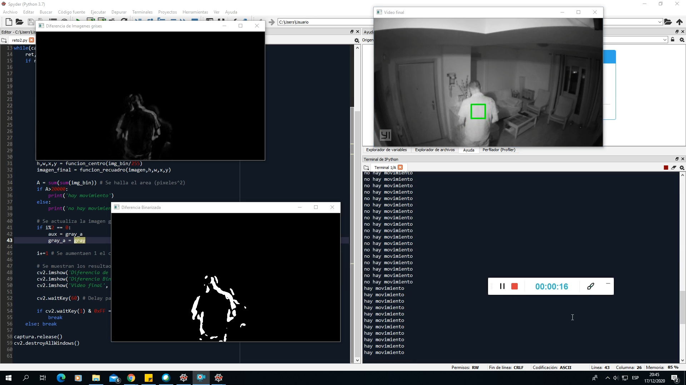
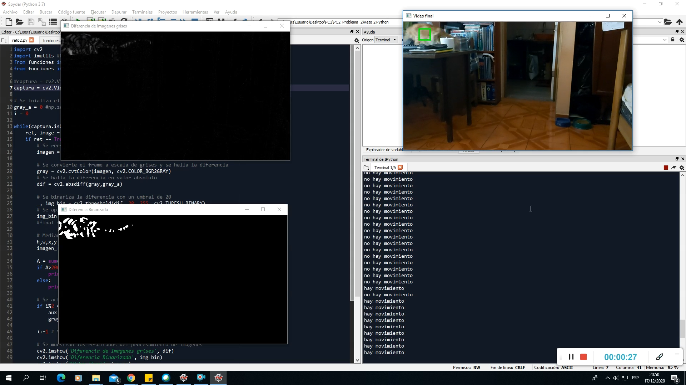

# Detección de movimiento
## Descripcion

	
Este codigo permite detectar movimientos incluso en lugares de poca ilumincacion mediante la diferencia entre 2 frames. El algoritmo en python y en matlab es lo mismo con la diferencia de las funciones y metodos que proporciona cada lenguaje. 

Ademas se crearon funciones para encerrar en un cuadro el area donde haya movimiento. El algoritmo tambien funciona en tiempo real y se puede ajustar los parametros del umbral y area de detección por si se desee probar este algoritmo en un caso mas especifico.

## Objetivo

Detectar el movimiento principalmente en lugares de poca ilumincacion usando funciones propias y funciones basicas para el procesamiento de imagenes.

## Resultados

